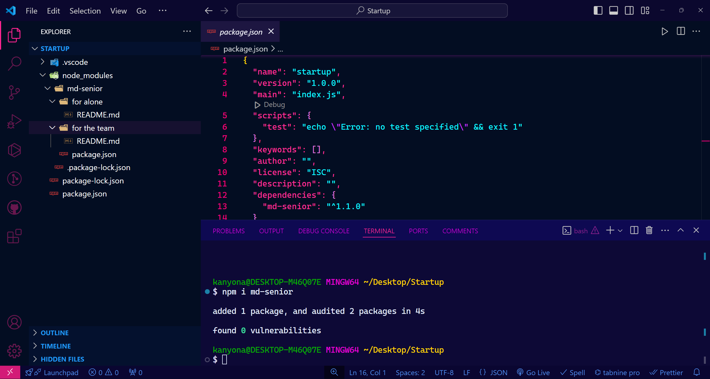
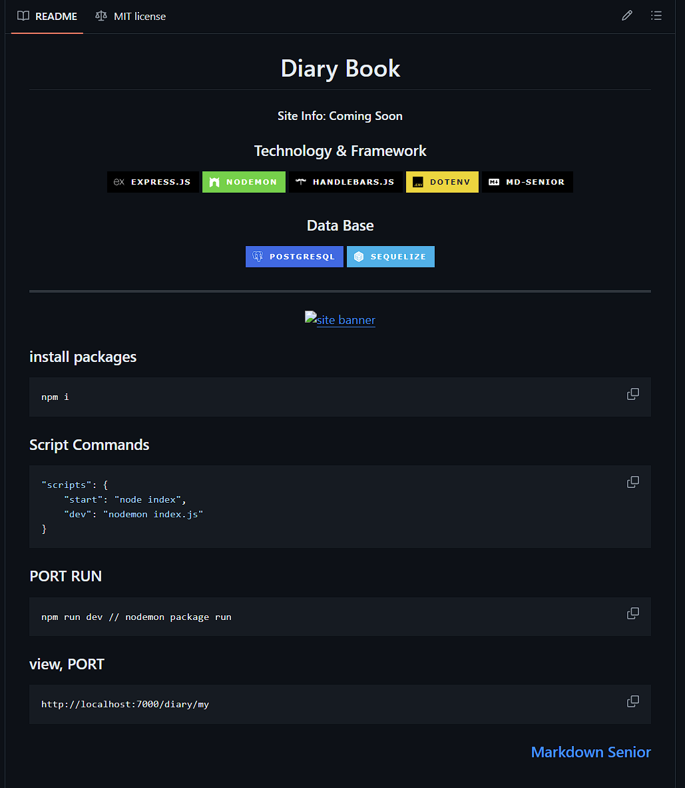
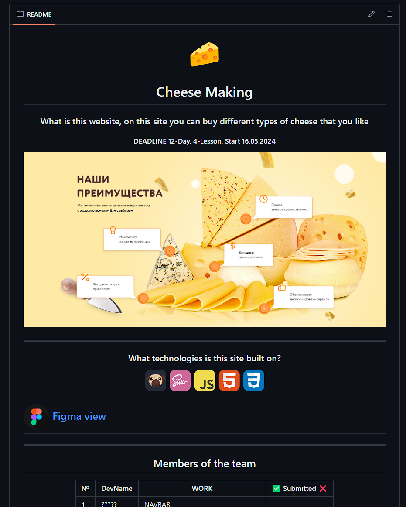
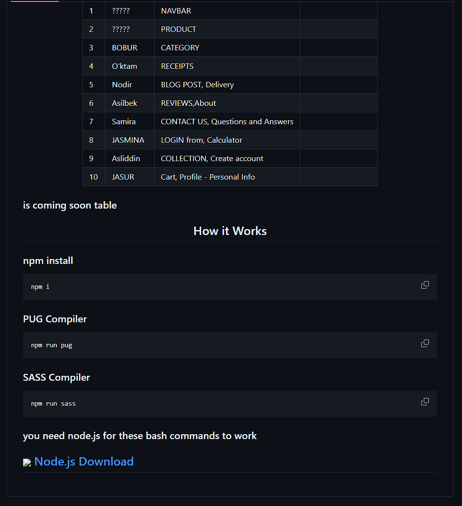
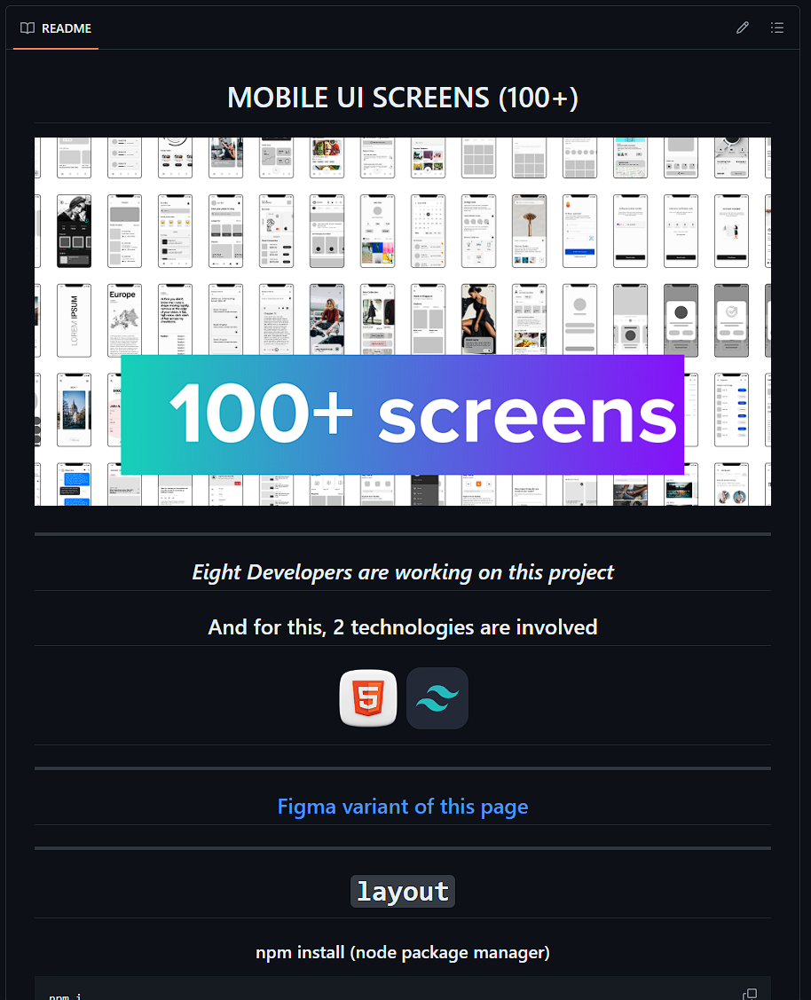

<div align=center>


# Hello, with this package you will get professional markdown skeleton

</div>


## md-senior package

---

## npm installation

```bash
npm install md-senior
```

## Extract from node modules file
```bash
mv node_modules/md-senior* .
```

---



### After installation, the `md-senior` file is added to the `node_mudules` file. and Extract from node modules file
```bash
mv node_modules/md-senior* .
```


### and `md-senior`file contains 2 files for team project and solo project

- md-senior/ --> for alone
- md-senior/ --> for the team

---

## used projects

<div align=center>







### and other ...